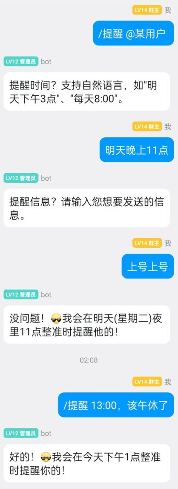
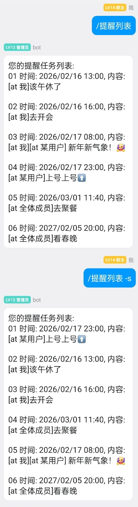
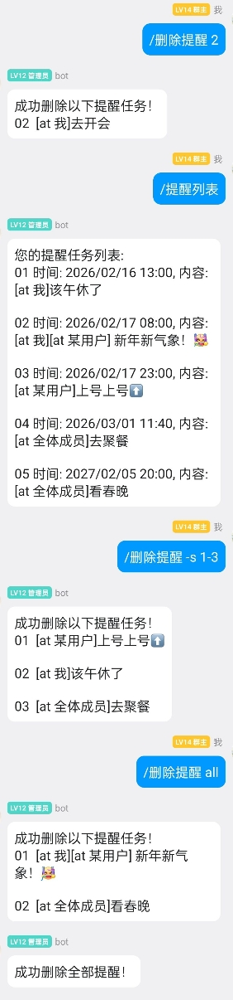
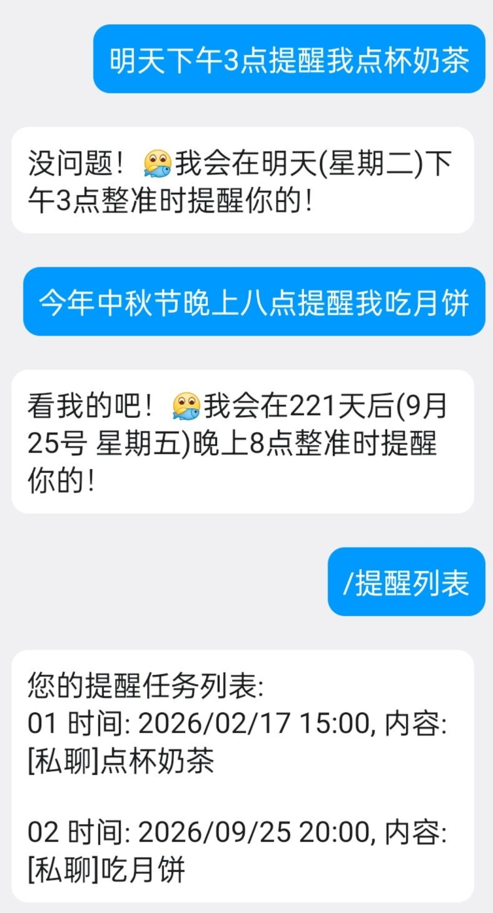

  
   
  

# nonebot-plugin-remind

## 📖 介绍

这是一个提供符合中国宝宝体质的定时提醒功能的插件。

## 💿 安装

使用 nb-cli 安装

在 nonebot2 项目的根目录下打开命令行, 输入以下指令即可安装

    nb plugin install nonebot-plugin-remind

使用包管理器安装

在 nonebot2 项目的插件目录下, 打开命令行, 根据你使用的包管理器, 输入相应的安装命令

**pip**

    pip install nonebot-plugin-remind

打开 nonebot2 项目根目录下的 `pyproject.toml` 文件, 在 `[tool.nonebot]` 部分追加写入

    plugins = ["nonebot_plugin_remind"]

## ⚙️ 配置

在 nonebot2 项目的`.env`文件中添加如下可选配置

|         配置项         | 必填  | 默认值 |                                                 说明                                                  |
| :--------------------: | :---: | :----: | :---------------------------------------------------------------------------------------------------: |
|   `remind_private_list_all`   |  否   | `True` |                            私聊中"/提醒列表"命令是否列出私聊群聊全部提醒                             |
| `remind_keyword_error` |  否   | `True` |                                  触发“提醒”关键词时是否发送错误提示                                   |
|      `remind_llm_api_key`     |  否   |  `""`  |            大模型 API Key（OpenAI 兼容接口；留空则禁用大模型兜底；需安装 `[llm]` 附加依赖）            |
|     `remind_llm_base_url`     |  否   |  `""`  | 大模型接口地址，例如智谱：`https://open.bigmodel.cn/api/paas/v4`；留空使用 SDK 默认（api.openai.com） |
|      `remind_llm_model`       |  否   |  `""`  |               用于解析提醒时间的模型名称（可对接任意兼容平台）                |

> **大模型兜底为可选能力**：需先安装附加依赖 `pip install nonebot-plugin-remind[llm]`；支持任意兼容 OpenAI Chat Completions 协议的服务（智谱、DeepSeek、硅基流动、本地 vLLM 等）。

> **从 0.1.x 升级**：0.3.0 起不再兼容 0.1.x 写下的任务文件。启动时若检测到旧格式文件，会转存一份带时间戳的备份（同目录 `remind_tasks.corrupt-<时间>.json`）并以空任务集启动，旧提醒请重新设置。

## 🎉 使用

### 关键词触发

#### 提醒
触发格式（支持两种语序）：
> [@][时间]'提醒'[被提醒人][消息]
>
> [@]'提醒'[被提醒人][时间][消息]

各部分解释：
- **[@]**（以下条件任意满足一条即可）
    - 在消息开头@机器人
    - 回复机器人的任意一条消息
    - 如果机器人设置了 `NICKNAME` 环境变量，则只需在消息开头称呼其昵称
    - 在私聊中，可以**省略**此部分，见文末示例图

- **[时间]**

    关键词触发和命令触发均使用 [jionlp](https://github.com/dongrixinyu/JioNLP) 进行自然语言时间解析，支持以下格式：
    - `明天下午3点`、`后天上午10点`、`下周一9点`
    - `半小时后`、`10分钟后`、`两个小时后`
    - `春节`、`国庆节`、`中秋节`
    - `2025-1-1 8:00`、`9月10日18:00`、`21:12`
    - ……

    安装 `[llm]` 附加依赖并正确配置 `remind_llm_api_key` 与 `remind_llm_model` 之后，jionlp 无法解析的时间表达式将由大模型（OpenAI 兼容接口）兜底解析，你将获得**更自由更符合人类语言的丰富体验**，包括但不限于：
    - `明天晚上八点1刻`
    - `20分钟后`
    - `下周三的同一时间`
    - `今年的教师节早上八点`
    - `10月1日提前10天的正午12点`
    - ……

    **特别提醒：** 简单需求使用轻量模型即可满足。越复杂的时间描述（如 `一坤时后` ）对大语言模型的理解能力需求越高，请结合所选平台自行选择合适的模型。

    除此之外，时间部分还支持**循环提醒**的设置（jionlp 可直接识别周期性时间表达式）：
    - `每年3月12日7:00`
    - `每月22日22:00`
    - `每周一三五18:00`
    - `每天15:00`、`每小时`
    - `每2小时`、`每隔30分钟`

    （`每 N 分钟/小时/天/周` 等间隔表达从设置时刻起算，例如 10:07 设置 `每隔30分钟`，会在 10:37、11:07 …… 依次提醒。）

    - **特别提醒：** 循环与间隔表达（如 `每隔2小时`）的解析与单次共用同一个模型与同一条提示词，对模型能力要求更高，这种场景下建议选择能力较强的模型。

- **'提醒'**： 要匹配的关键字，必须完全一致

- **[被提醒人]**（以下格式均符合要求）
    - `我`：提醒设定提醒的人自己
    - `[@]`:可以@多个用户，包括自己，也可以@全体成员
    - `我和[@]`：必须我在前面，其他@用户在后
    - `all` 或者 `所有人`: 等同于`@全体成员`，提供一个非打扰式的提醒设定

- **[消息]**
    - 任意消息（支持图片、QQ黄脸表情等富文本消息）均可，前提是必须在同一条消息中发送出

示例：
1. `@机器人 16:00提醒我去开会`
2. `@机器人 提醒我明天下午3点去开会` 
3. `@机器人 提醒我半小时后喝水` 
4. `机器人昵称，1月1日11:40提醒所有人去聚餐`
5. `机器人昵称 2025年1月29日8:00提醒我和@用户1 用户2 新年新气象！`

### 指令触发
以下触发均需要指令前缀，如未设置默认为`/`。

#### 提醒

- 提供1个参数为 `被提醒人`，以交互的方式设置提醒：

- 提供3个参数，以英文逗号`,`间隔，依次为：`被提醒人`，`时间`和`提醒消息`：

> 以上两种命令的触发方式均可省略 `被提醒人` 参数，省略时默认被提醒人为“我”。

#### 提醒列表（单次提醒列表）

**列表顺序默认按提醒时间顺序排序，使用 `-s` 选项按设置提醒的先后顺序排序**

当在群聊中触发此指令时，仅返回在群聊内设置的提醒。

当在私聊中触发此指令时，返回所有私聊和群聊中设置的提醒。

**注意**：当配置环境变量 `remind_private_list_all=false` 时，私聊时也仅返回私聊中设置的提醒。

#### 循环提醒列表

此命令只会输出设置的循环提醒任务，**不支持** `-s` 选项的排序，默认按照设置顺序排序。

#### 删除提醒（删除单次提醒）

**使用的列表顺序默认按提醒时间顺序排序，使用 `-s` 选项按设置提醒的先后顺序排序的序号删除**

> 注意：在删除提醒之前一定要先通过 `/提醒列表` 指令查看序号！每次删除后后续序号都会更新！

示例：
1. `/删除提醒 1`：删除序号为1的提醒（默认按提醒时间排序）
2. `/删除提醒 -s 1-3 5`：批量删除序号为1、2、3、5的提醒（按设置时间排序）
3. `/删除提醒 all`：一键删除所有提醒（仅当前群聊）

#### 删除循环提醒

与 `/删除提醒` 命令用法相同，同样**不支持** `-s` 选项排序，必须提供由 `/循环提醒列表` 命令查看得到的任务序号。

### 示例图

本示例，均为未启用大模型兜底的情况下，基于 jionlp 进行时间解析所实现的。

<table style="width:100%; border-collapse: collapse;">
  <thead>
    <tr style="border: 1px solid black;">
      <th style="text-align:center; border: 1px solid black;">提醒命令示例图</th>
      <th style="text-align:center; border: 1px solid black;">提醒关键词示例图</th>
      <th style="text-align:center; border: 1px solid black;">提醒列表命令示例图</th>
      <th style="text-align:center; border: 1px solid black;">删除提醒命令示例图</th>
      <th style="text-align:center; border: 1px solid black;">私聊使用示例图</th>
    </tr>
  </thead>
  <tbody>
    <tr style="border: 1px solid black;">
      <td style="text-align:center; border: 1px solid black;">
        
      </td>
      <td style="text-align:center; border: 1px solid black;">
        
      </td>
      <td style="text-align:center; border: 1px solid black;">
        
      </td>
      <td style="text-align:center; border: 1px solid black;">
        
      </td>
      <td style="text-align:center; border: 1px solid black;">
        
      </td>
    </tr>
  </tbody>
</table>
